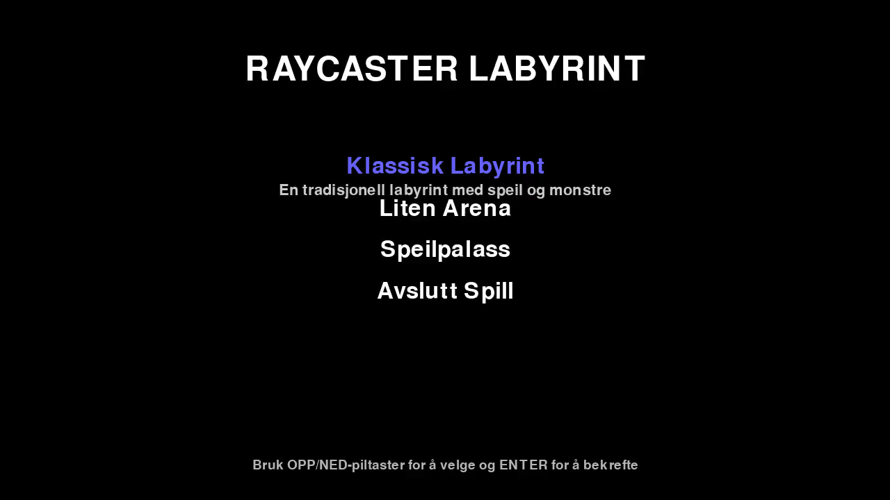
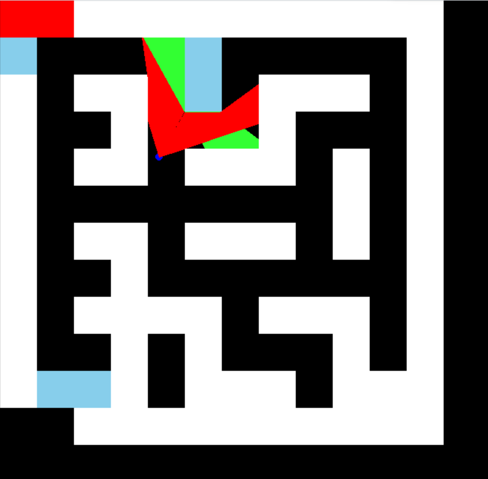
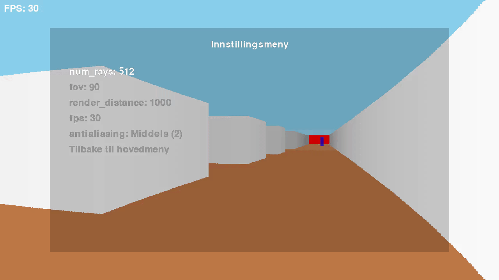
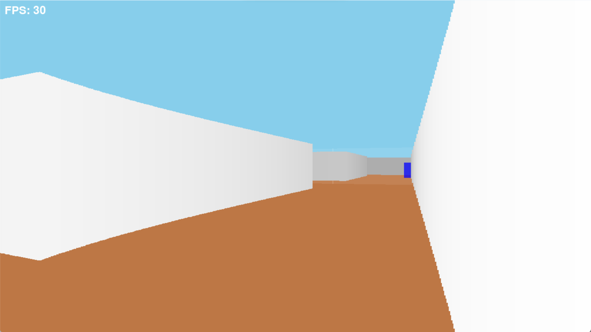
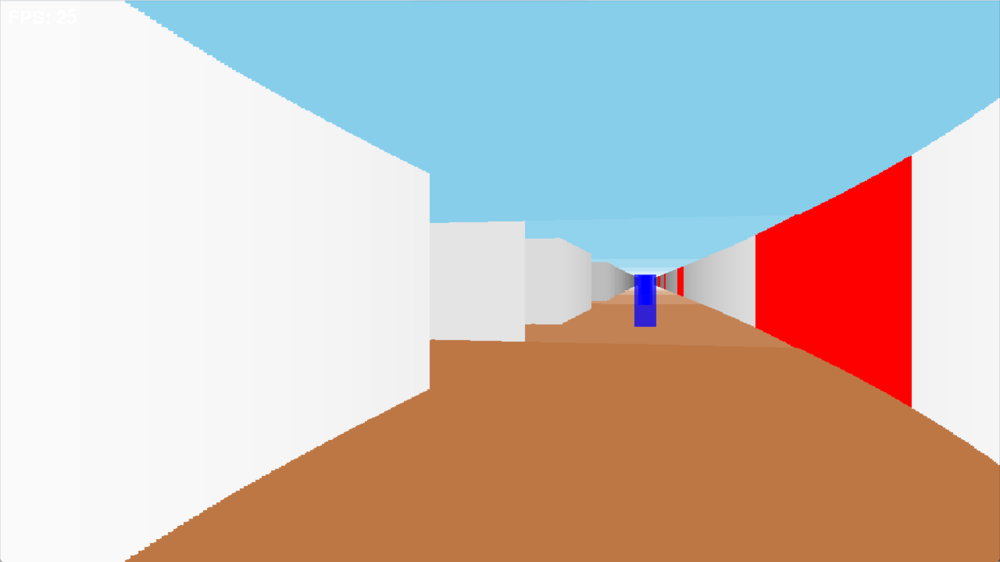
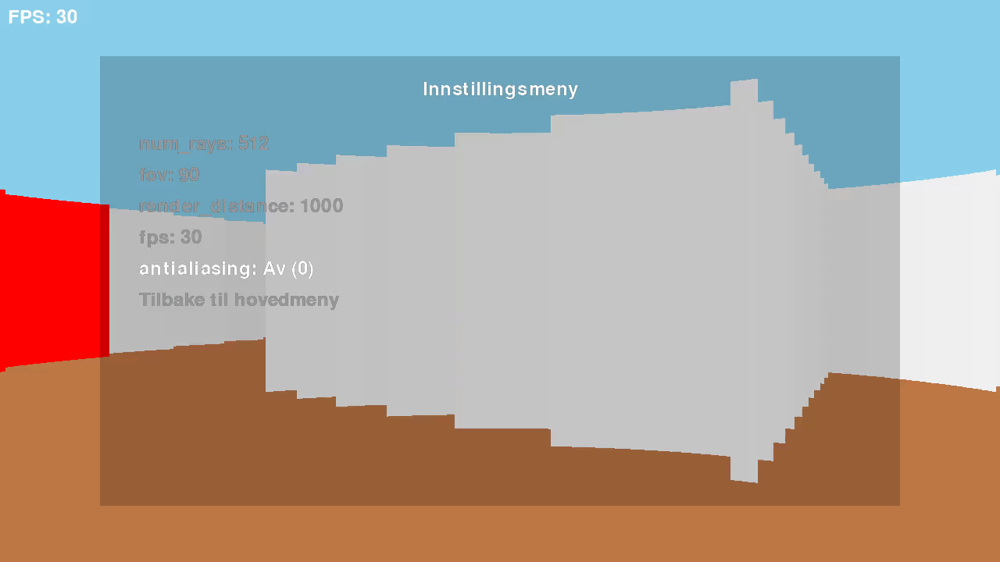
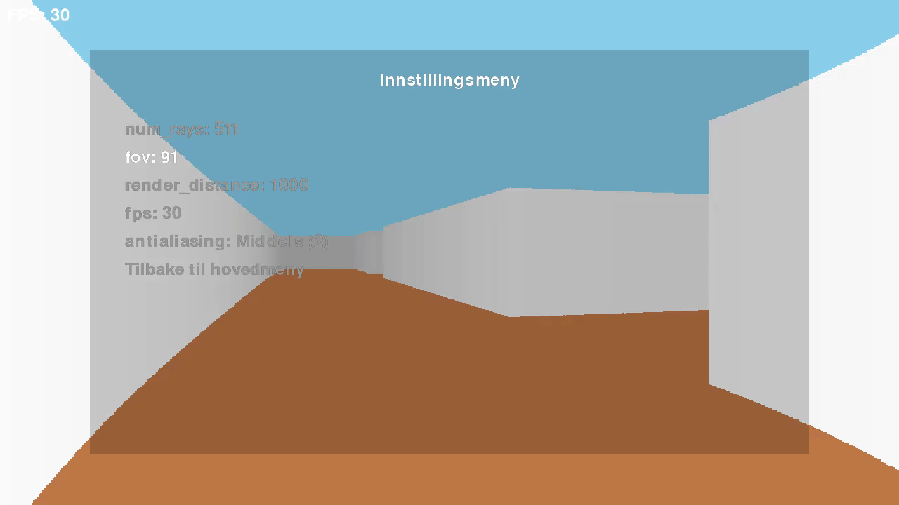
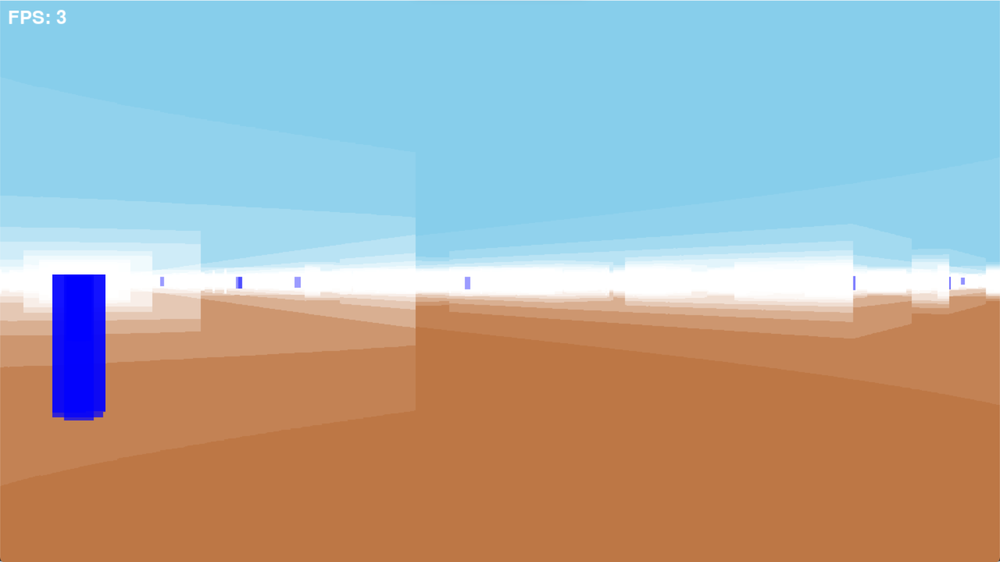
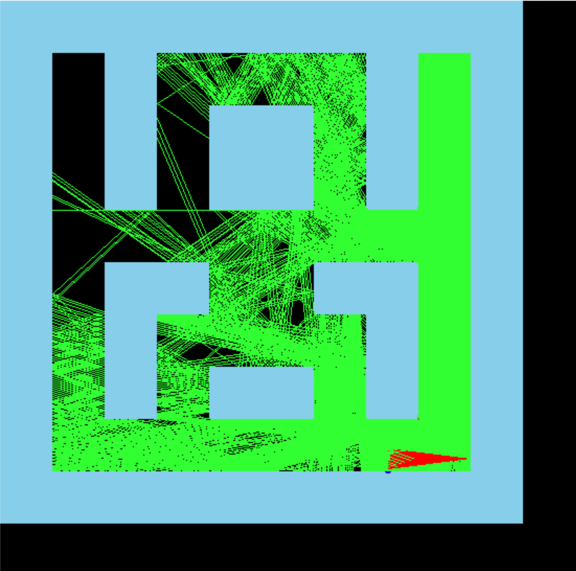
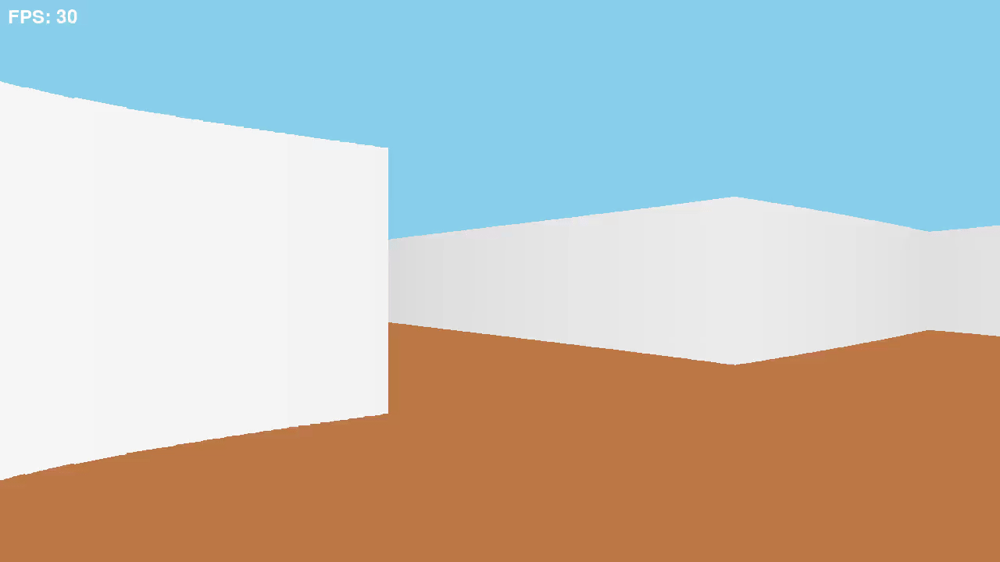

# Maze Raycaster

A first-person maze navigation game built with raycasting, reflections, and enemy pathfinding.

## Controls

- `W`, `A`, `S`, `D` — move
- `I`, `J`, `K`, `L` — look around
- `Shift` — faster movement
- `Tab` — toggle map
- `R` — toggle ray overlay
- `Esc` — menu

## Gameplay



The player moves through a maze while the raycaster turns a 2D grid into a 3D-looking scene using distance-based wall height, perspective, and shading. The illusion works by casting many rays from the camera and measuring how far each one travels before it hits a wall.

## How it works

A ray is cast for each screen column, checked against the maze, and the distance is converted into wall height. The farther the wall, the shorter it appears on screen. The red rays are the initial rays from the player, while the green ones are reflected rays.



The effect depends on the number of rays, each column is effectively one sample, so more rays means a sharper, more detailed view. A lower resolution version looks blocky because fewer rays are being used to describe the scene.



## Raytracing

When a ray hits a reflective wall, the renderer flips the direction using the wall normal and traces a new ray from that point. This recursive pass keeps going for each bounce, so a single primary ray can generate several reflected rays and produce a layered mirror effect. The second image shows this idea in practice: red rays are the initial cast from the player, while green rays are the reflected branches that continue the trace through the maze.




## Custom antialiasing



This is a lightweight fake antialiasing pass. Because the maze is raycast on a grid, wall edges can look jagged at corners and diagonals. Instead of trusting the first hit point, the renderer steps back a little and samples smaller increments around that area to find a more accurate wall contact. This helps smooth the edge without needing a full, expensive antialiasing pass.

It is surprisingly efficient because the extra check is only done near the hit point, not for every pixel or every ray in the whole scene. The result is a much cleaner edge for very little extra cost.

## Field of view



The field of view controls how wide the camera sees. A larger value makes the maze feel more open, while a smaller value tightens the view.

## Mirror maze




This is a concept mirror chamber built to exaggerate reflection depth. The whole map is effectively made of mirrored surfaces, so every bounce keeps tracing a new path and creates the layered, recursive echo effect seen in the images. The recursion depth is pushed high here for visual effect, so this is more of a showcase than a practical setting.

## Pathfinding



I added a few entities that use A* to path toward the player's current position. The maze is treated as a grid, so the algorithm finds the shortest valid route around walls and follows it as the player moves.

This was mainly added as a learning exercise in pathfinding.

## Dependencies

- Python 3
- pygame
- numpy

## Run it

1. Install the requirements:
   ```bash
   pip install pygame numpy
   ```
2. Start the game:
   ```bash
   python game.py
   ```
